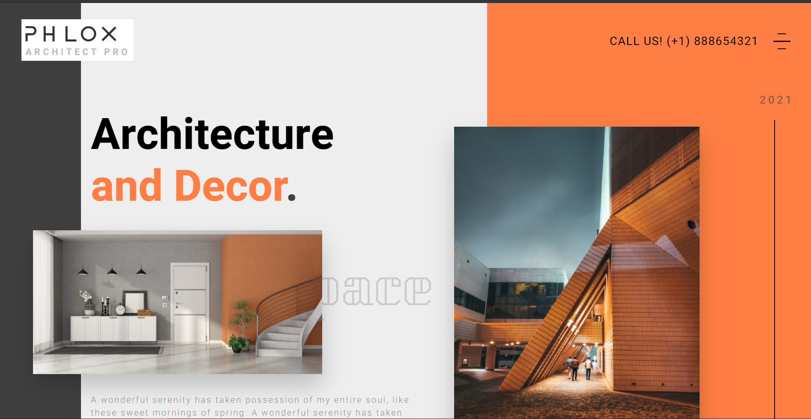

## Architecture Website | RH-Theory

***

#### Introduction

***

This front-end design was made by taking inspiration by PHLOX. Sole purpose of this project was to learn and practise advanced concepts of HTML and CSS.

#### Contributors

***

>[Rishita Shaw](https://www.linkedin.com/in/rishita-shaw-75901a186 "Rishita Shaw") 

>[Himanshu Khaitan](https://www.linkedin.com/in/himanshu-khaitan "Himanshu Khaitan")

#### Design Inspiration

***

> "Architecture and Decor" [Phlox Architect](https://demo.phlox.pro/portfolio-architect/?utm_source=landing-pro "Phlox Architect")

#### Tech Stack Used

***

#### Installation

***

No such Installation is required. 

> Happily turning COFFEE into CODE!